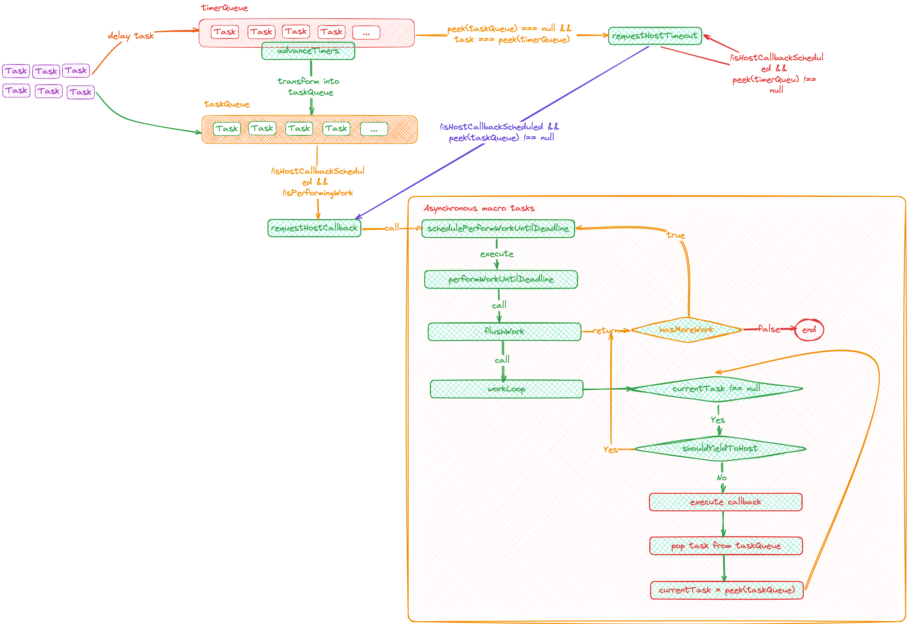

# 源码分析 - Scheduler - 调度器

> 源码分析，基于 React 18.2.0 版本
>
> 

## 任务调度

### 数据结构

从源码 SchedulerMinHeap.js 分析，调度队列采用「最小堆」实现。

```
// 任务数据结构
type TaskNode = {
  sortIndex: number
  id: number
  ...
}
```

其 compare 函数，优先比较 sortIndex，其次 id。

### 使用

在 Scheduler.js 中，根据当前调用程序的时间以及任务的优先级，存在两种队列：

- taskQueue：立即执行的任务队列
- timerQueue：待执行（延时）的任务队列


## 创建调度任务 -「unstable_scheduleCallback」

- 参数：
  - priorityLevel： 调度优先级
  - callback： 任务回调函数
  - options：杂项，delay：延时时长，单位ms

- 返回值：
  ```
  // 调度任务
  type Task = {
    id: number
    callback: (didTimeout: boolean, ...args: any[]) => any,
    priorityLevel: ImmediatePriority | UserBlockingPriority | NormalPriority | LowPriority | IdlePriority,
    startTime: number,
    expirationTime: number,
    sortIndex: number,
  }
  ```

- 内部逻辑：
  - 解析 options 参数，计算任务计划开始的时间 - startTime
  - 根据 priorityLevel 优先级，计算任务超时的时长 - timeout
  - 计算 expirationTime 任务过期时间，即： startTime + timeout
  - 初始化创建调度任务
  - 根据任务启动时间（startTimeout）和当前时间（currentTime）比较，决策任务进入「taskQueue」，还是「timerQueue」

## schedulePerformWorkUntilDeadline - 异步宏任务

通过 requestHostCallback 调用 schedulePerformWorkUntilDeadline，开启异步宏任务调度。
schedulePerformWorkUntilDeadline 为适配各种浏览器以及 Nodejs 环境，该函数采用不同方式实现：

- NodeJS + IE浏览器： 使用 setImmediate 宏任务实现
- 现代浏览器： 使用 MessageChannel 实现，引申：为什么不使用 setTimeout ？  setTimeout 有 4ms 浪费
- 最坏情况： 使用 setTimeout 实现

## workLoop - 循环调度

- 入参：
  - hasTimeRemaining： boolean，剩余时间
  - initialTime： number，开启循环调度时间

- 返回值：boolean
  - 若 currentTask 不为 null，返回 true，从而在 performWorkUntilDeadline 中，重新调用 schedulePerformWorkUntilDeadline，开启 workLoop
  - 反之，返回 false；若 timerQueue 不为空，则调用 requestHostTimeout

- 内部逻辑：
  - 根据 initialTime，调用 advanceTimers，将符合条件的延时任务转移至taskQueue
  - 获取 taskQueue 中最高任务，进入 while 循环：
    - 跳出循环条件：
      - currentTask === null
      - 当前任务过期，且执行时间过长，需将执行权移交给主线程（浏览器线程）
    - 执行逻辑：
      - 获取当前任务的回调函数
      - 若回调函数为 Function
        - 执行回调函数
        - 删除 taskQueue 堆顶元素
        - 调用 advanceTimers，将符合条件的延时任务转移至taskQueue
        - 设置 currentTask = peek(taskQueue)
      - 若回调函数不为 Function
        - 删除 taskQueue 堆顶元素
        - 设置 currentTask = peek(taskQueue)
  
## shouldYieldToHost - 判断是否应移交程序执行权至浏览器线程

通过计算函数执行的时间，判定是否移交执行权。

计算形式：
  - startTime：在 performWorkUntilDeadline 中 赋值
  - endTime: 调用 shouldYieldToHost 的时间

若 endTime - startTime < 5ms，则表明无需移交执行权限，可继续执行；反之，则移交执行权至浏览器线程